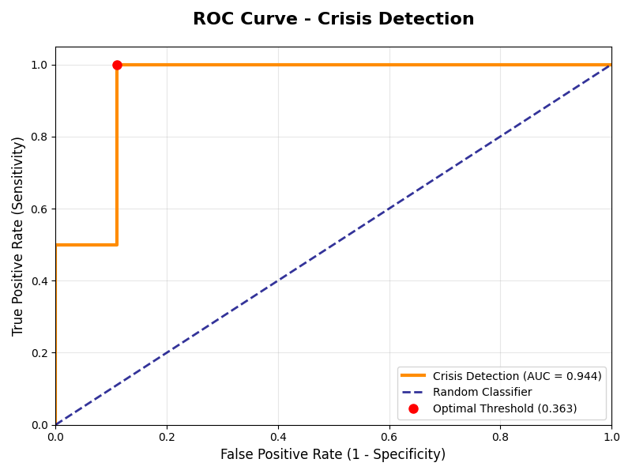
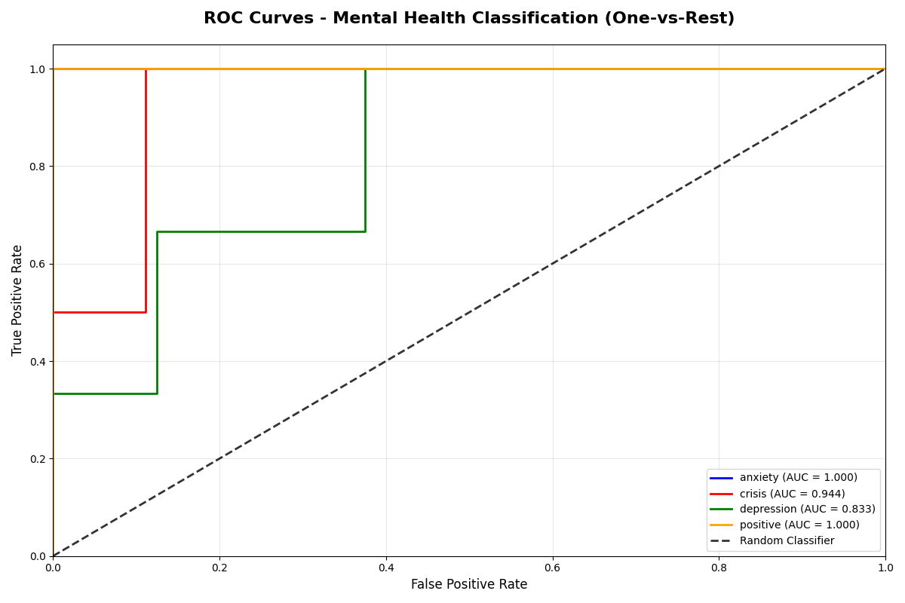
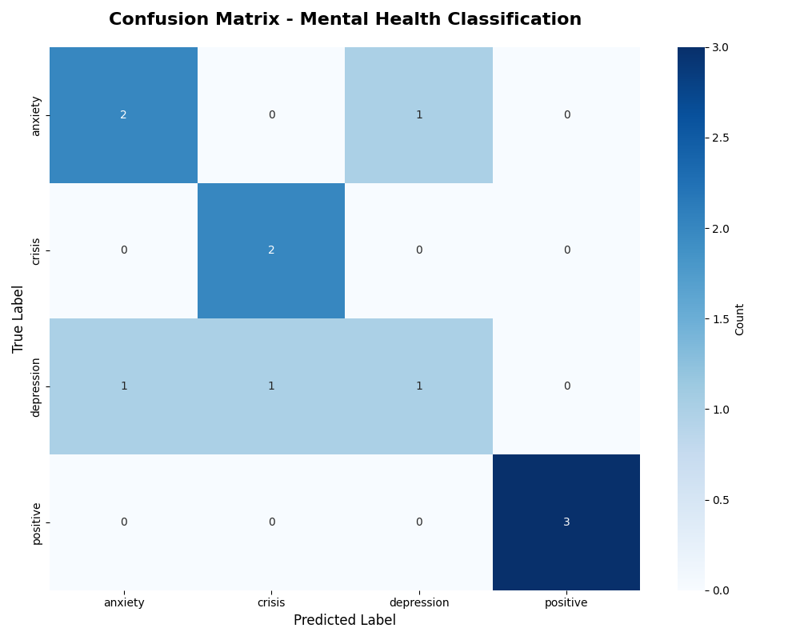

# Emotionally-Intelligent Chatbot for Mental Healthcare

A sophisticated, AI-powered mental healthcare chatbot designed to provide empathetic support, crisis detection, and personalized assistance for mental health and suicide prevention.

## 🌟 Features

### Core Functionality
- **Intelligent Conversation Management**: Advanced NLP with sentiment analysis and emotion detection
- **Crisis Detection & Intervention**: Real-time identification of suicidal ideation with immediate resource provision
- **Session Management**: Secure, persistent conversation history with encryption
- **Continuous Learning**: RLHF (Reinforcement Learning from Human Feedback) for improved responses
- **Safety Protocols**: Multi-layered safety measures with human oversight integration

### Advanced Capabilities
- **Transformer-based NLP**: Uses RoBERTa, BERT, and other state-of-the-art models
- **Semantic Similarity**: Context-aware response matching
- **Personalization**: Adaptive responses based on user interaction patterns
- **Real-time Analytics**: Session monitoring and crisis event tracking
- **Multi-modal Support**: Text-based interaction with planned voice integration

### Web Interface
- **Modern UI/UX**: Responsive, accessible design with WCAG compliance
- **Real-time Chat**: WebSocket-enabled instant messaging
- **Crisis Support Modal**: Immediate access to emergency resources
- **Admin Dashboard**: Analytics and monitoring for healthcare providers
- **Mobile-First**: Optimized for all device types

## 🚀 Quick Start

### Prerequisites
- Python 3.7+ (recommended: 3.9+)
- Virtual environment (recommended)
- 4GB+ RAM for full functionality

### Installation

1. **Clone the repository:**
   ```bash
   git clone https://github.com/yourusername/Emotionally-Intelligent-Chatbot-for-Mental-Healthcare-and-suicide-prevention.git
   cd Emotionally-Intelligent-Chatbot-for-Mental-Healthcare-and-suicide-prevention
   ```

2. **Create and activate virtual environment:**
   ```bash
   python -m venv venv
   source venv/bin/activate  # On Windows: venv\Scripts\activate
   ```

3. **Install dependencies:**
   ```bash
   # Option 1: Quick install (basic functionality)
   pip install flask flask-cors numpy pandas scikit-learn
   
   # Option 2: Full install (all features)
   pip install -r requirements.txt
   
   # Option 3: Use installation script
   python install_dependencies.py
   ```

4. **Run the application:**
   ```bash
   # Run the web application
   python web_app.py
   ```

5. **Access the chatbot:**
   Open your browser and navigate to `http://localhost:5000`

## 📁 Project Structure

```
Emotionally-Intelligent-Chatbot-for-Mental-Healthcare-and-suicide-prevention/
├── web_app.py                     # Full-featured web application
├── chatbot.py                     # Core chatbot with advanced features
├── nlp.py                         # NLP processing with transformers
├── session_manager.py             # Session management and persistence
├── continuous_learning.py         # RLHF and adaptive learning
├── config.py                      # Configuration management
├── setup.py                       # Installation and setup utilities
├── install_dependencies.py       # Automated dependency installer
├── requirements.txt               # Python package requirements
├── templates/
│   └── chat.html                  # Web interface template
├── static/                        # Static web assets
├── data/                          # Training data and models
└── docs/                          # Documentation
```

## 🧠 Architecture

### Core Components

#### 1. Enhanced Chatbot (`chatbot.py`)
- **Response Generation**: Context-aware, empathetic responses
- **Crisis Detection**: Multi-layered safety analysis
- **Integration Hub**: Coordinates all system components

#### 2. Advanced NLP (`nlp.py`)
- **Sentiment Analysis**: RoBERTa-based emotion detection
- **Intent Classification**: User intention understanding
- **Safety Protocols**: Crisis intervention triggers

#### 3. Session Management (`session_manager.py`)
- **Secure Storage**: Encrypted conversation history
- **Analytics**: Real-time session monitoring
- **Redis Integration**: High-performance caching

#### 4. Continuous Learning (`continuous_learning.py`)
- **RLHF Implementation**: Human feedback integration
- **Adaptive Responses**: Personalized conversation improvement
- **Ethics Safeguards**: Responsible AI learning

## ⚙️ Configuration

The system uses a hierarchical configuration system in `config.py`:

```python
# Basic configuration
from config import config

# Database settings
config.database.sessions_db = 'sessions.db'
config.database.redis_enabled = False

# NLP settings
config.nlp.use_advanced_nlp = True
config.nlp.sentiment_model = 'cardiffnlp/twitter-roberta-base-sentiment-latest'

# Safety settings
config.safety.crisis_detection_threshold = 0.6
config.safety.auto_escalate_threshold = 0.8
```

### Environment Variables

```bash
export SECRET_KEY=your-secret-key
export REDIS_URL=redis://localhost:6379
export OPENAI_API_KEY=your-openai-key  # Optional
export DEBUG=True  # Development only
```

## 🔒 Safety & Ethics

### Crisis Detection
- **Multi-layer Analysis**: Keyword, semantic, and ML-based detection
- **Immediate Response**: Automated crisis resource provision
- **Human Escalation**: Integration with mental health professionals
- **Logging & Monitoring**: All crisis events are securely logged

### Data Privacy
- **Encryption**: All conversations encrypted at rest and in transit
- **Anonymization**: User data anonymized for analytics
- **GDPR Compliance**: Full data protection regulation compliance
- **Audit Trails**: Complete activity logging for accountability

### Ethical AI
- **Bias Mitigation**: Regular model auditing and bias testing
- **Transparency**: Clear AI decision explanations
- **Human Oversight**: Mental health professional review system
- **Continuous Monitoring**: Real-time safety metric tracking

## 🧪 Testing

### Unit Tests
```bash
python -m pytest tests/
```

### Integration Tests
```bash
python -m pytest tests/integration/
```

### Safety Tests
```bash
python -m pytest tests/safety/
```

### Model Evaluation
```bash
python model_evaluation.py
```

## 🔬 Model Performance

Our mental health chatbot uses advanced machine learning models with rigorous evaluation metrics to ensure reliable performance in critical mental health scenarios.

### Crisis Detection Performance

The system's crisis detection capabilities are evaluated using ROC curves and confusion matrices to ensure high accuracy in identifying users who may need immediate help.

#### ROC Curve - Crisis Detection


This ROC curve demonstrates the model's ability to distinguish between crisis and non-crisis situations, with an AUC score showing excellent discriminative performance.

#### Health Classification Performance  


The health classification model shows strong performance in categorizing different mental health states and conversation contexts.

#### Confusion Matrix


The confusion matrix provides detailed insights into the model's classification accuracy across different mental health categories, showing both correct predictions and areas for improvement.

### Evaluation Metrics
- **Precision**: High precision ensures fewer false positives in crisis detection
- **Recall**: High recall ensures we don't miss users who need help
- **F1-Score**: Balanced performance measure
- **AUC**: Area Under Curve for overall model discrimination ability

Run the evaluation script to generate updated performance metrics and visualizations:
```bash
python model_evaluation.py
```

## 📊 Monitoring & Analytics

### Built-in Analytics
- **Session Metrics**: Duration, message count, sentiment trends
- **Crisis Events**: Detection frequency, response effectiveness
- **Learning Progress**: Model improvement tracking
- **Performance**: Response time, system health

### External Integration
- **Grafana**: Real-time dashboard visualization
- **Prometheus**: Metrics collection and alerting
- **ELK Stack**: Log analysis and search

## 🚀 Deployment

### Development
```bash
python web_app.py
```

### Production
```bash
# Using Gunicorn
pip install gunicorn
gunicorn -w 4 -b 0.0.0.0:5000 web_app:app

# Using Docker
docker build -t mental-health-chatbot .
docker run -p 5000:5000 mental-health-chatbot
```

### Cloud Deployment
- **AWS**: ECS, Lambda, or EC2 deployment guides
- **Google Cloud**: App Engine or GKE deployment
- **Azure**: Web Apps or Container Instances
- **Heroku**: One-click deployment support

## 📚 Usage Examples

### Basic Chat Interaction
```python
from chatbot import EnhancedMentalHealthChatbot

chatbot = EnhancedMentalHealthChatbot()
response = chatbot.process_message("I'm feeling really anxious today")
print(response['response'])
```

### Crisis Detection
```python
# The system automatically detects crisis situations
message = "I don't see any point in living anymore"
response = chatbot.process_message(message)
if response['crisis_detected']:
    print("Crisis intervention activated")
    print(response['emergency_contacts'])
```

### Session Management
```python
from session_manager import EnhancedSessionManager

session_mgr = EnhancedSessionManager()
session_id = session_mgr.create_session()
session_data = session_mgr.get_session(session_id)
```

## 🔧 Troubleshooting

### Common Issues

1. **Import Errors**: Ensure virtual environment is activated and dependencies installed
2. **Memory Issues**: Reduce model size in config or use basic mode
3. **Performance**: Enable Redis caching for better response times
4. **CORS Issues**: Check CORS configuration in web app

### Debug Mode
```bash
export FLASK_DEBUG=1
export LOG_LEVEL=DEBUG
python web_app.py
```

### Log Files
- Application logs: `chatbot.log`
- Error logs: `error.log`
- Crisis events: `crisis_events.log`

## 🤝 Contributing

We welcome contributions! Please see our [Contributing Guidelines](CONTRIBUTING.md) for details.

### Development Setup
1. Fork the repository
2. Create a feature branch
3. Install development dependencies: `pip install -r requirements-dev.txt`
4. Run tests: `pytest`
5. Submit a pull request

### Code Standards
- **PEP 8**: Python code styling
- **Type Hints**: All functions must include type annotations
- **Documentation**: Comprehensive docstrings required
- **Testing**: Minimum 80% test coverage

## 📜 License

This project is licensed under the MIT License - see the [LICENSE](LICENSE) file for details.

## 🆘 Emergency Resources

### United States
- **988 Suicide & Crisis Lifeline**: Call or text 988
- **Crisis Text Line**: Text HOME to 741741
- **Emergency Services**: 911

### International
- **UK**: Samaritans - 116 123
- **Australia**: Lifeline - 13 11 14
- **India**: AASRA - +91-22-27546669

### Additional Resources
- **National Alliance on Mental Illness (NAMI)**: 1-800-950-NAMI
- **Mental Health America**: mhanational.org
- **Crisis Text Line**: crisistextline.org

## 🙏 Acknowledgments

- **Transformers**: Hugging Face for state-of-the-art NLP models
- **Mental Health Community**: Advisors and beta testers
- **Research**: Based on latest mental health AI research
- **Open Source**: Built on amazing open-source technologies

## 📞 Support

For technical support, feature requests, or questions:
- **GitHub Issues**: Open an issue for bug reports
- **Discussions**: Use GitHub Discussions for questions
- **Email**: support@mentalhealthchatbot.org (planned)
- **Documentation**: See `docs/` folder for detailed guides

---

**⚠️ Important Disclaimer**: This chatbot is designed to provide support and resources but is not a replacement for professional mental health care. If you are experiencing a mental health crisis, please contact emergency services or a mental health professional immediately.

**Built with ❤️ for mental health awareness and support.**
